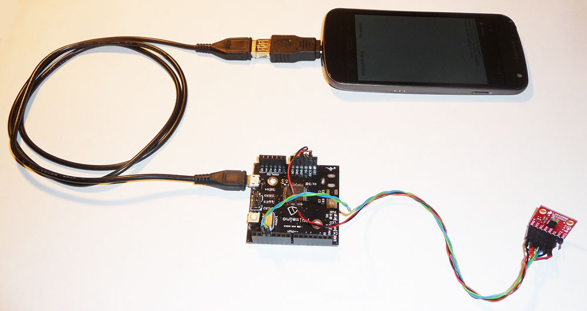
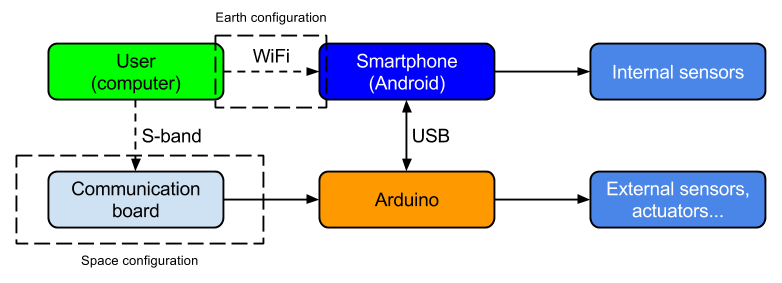
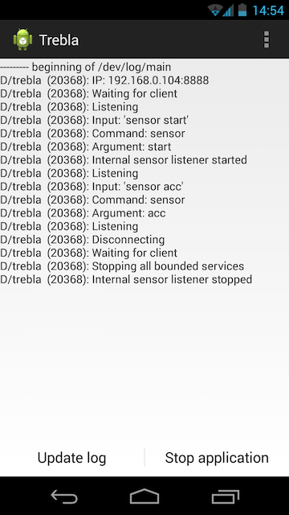
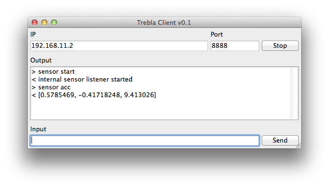
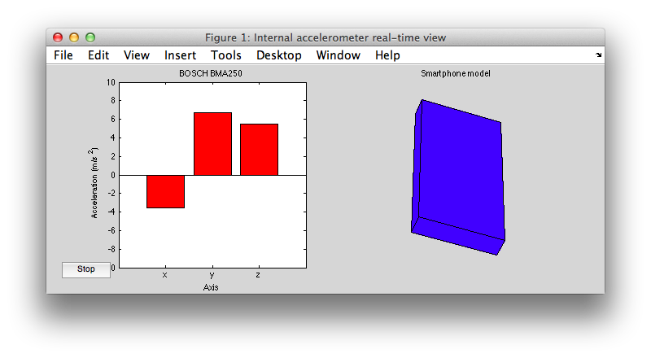
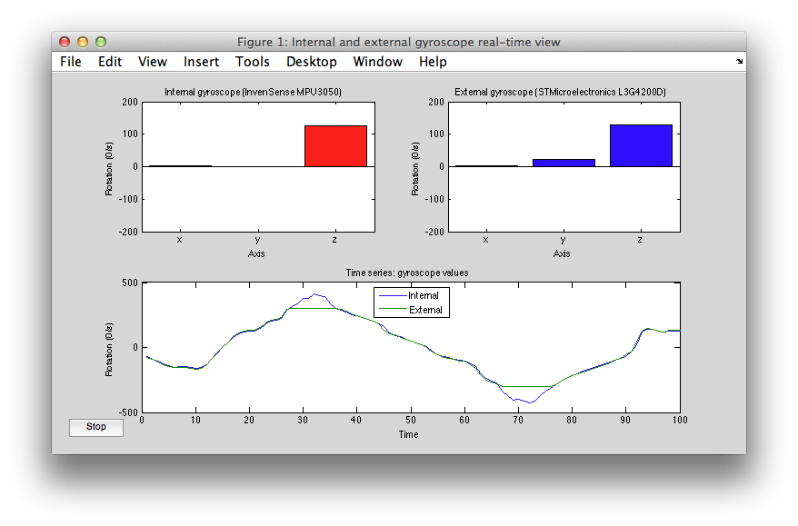

# Trebla: Smartphone based sensor data collection system for earth and space applications

Trebla is an Android application that uses the smartphone's sensors and the [Android USB host feature](http://developer.android.com/guide/topics/connectivity/usb/host.html) to connect to external devices in order to do sensor logging or actuator command. It uses the built-in communications systems (WiFi) to forward data to the user. In this project an [Arduino Leonardo compatible board](https://github.com/Robopoly/PRismino) was used for the external device.

The ultimate goal is to send an Android smartphone to space and use this application to interact with the smartphone which would make it a cost effective [PhoneSat project](http://en.wikipedia.org/wiki/PhoneSat).

This project was started as a Master's semester project at the [Swiss Space Center](http://space.epfl.ch) in the [Swiss Federal Institute of Technology in Lausanne (EPFL)](http://www.epfl.ch).

It is by no means finished at this point, lacking in robustness it's far from ready of going to space, but it has been tested and works.

## Project report

This is a summary of the **complete project report** in the `Report` folder, please refer to it for more information and references.

## Physical system overview

The smartphone (Galaxy Nexus) is connected to the external device ([Arduino Leonardo clone](https://github.com/Robopoly/PRismino)) via an USB On-The-Go (OTG) cable (using a USB-A to USB-Micro-B adapter) which provides power and data connection between the phone and the device. An I2C external gyroscope sensor is connected to the external device for demonstration. All systems are powered by the smartphone's battery.

## Configuration

The application has two configurations.

* In earth configuration it is programmed to receive commands via WiFi, process them and reply. It creates a socket server on the smartphone and waits for a client to connect.

* In space configuration WiFi cannot be used so the commands go through the external device that forwards commands via USB to the application for processing. Some external custom-made communications electronics has to be used.

Currently only the earth configuration has been implemented.

## Application

To use the application one has to install the .apk in any recent Android phone with an Android operating system version of 4.3 or higher. The application will display the phone's IP and a log of received commands that has to be updated manually via an on-screen button, then a simple socket based connection must be established and the user can sample internal sensors or connect to the external device via terminal like interface.

### Commands

These are the currently available commands:

| Instruction | Parameters  | Description |
| -----------| ----------- | ----------- |
| `sensor`   | `start`     | Starts sensor sampling service, samples all internal sensors. Without this the internal sensors cannot be sampled. |
| `sensor`   | `stop`      | Stops sensor sampling service. |
| `sensor`   | `acc`       | Accelerometer data in `[<x>,<y>,<z>]` format, units in m/s^2. |
| `sensor`   | `gyro`      | Gyroscope data in `[<x>,<y>,<z>]` format, units in rad/s. |
| `sensor`   | `temp`      | Temperature value in `[<temperature>]` format in Celsius. |
| `sensor`   | `pressure`  | Absolute pressure value in `[<pressure>]` format, units in hPa (millibar). |
| `sensor`   | `proximity` | Proximity sensor value in `[<proximity>]` format in centimeters. |
| `sensor`   | `light`     | Light sensor value in `[<light>]` format, units in lux. |
| `sensor`   | `mfield`    | Magnetic field data in `[<x>,<y>,<z>]` format, units in micro-Tesla (uT). |
| `sensor`   | `rh`        | Relative humidity value in `[<rh>]` format in percent. |
| `sensor`   | `rotation`  | Rotation values which are filtered values using the compass, accelerometer and gyroscope, refer to the official documentation for more information for these values. |
| `usb`      | `connect`   | Establish a connection with the external connected USB device. |
| `usb`      | `-list`     | List all connected USB devices with all their attributes, only one device can be connected at a time so only one device will be shown when connected. |
| `usb`      | `-w [data]` | Send data to the USB device, the device must be connected with usb connect beforehand. It returns the number of transferred bytes. |
| `usb`      | `-r`        | Starts the asynchronous USB reading thread. Needed to receive data from the USB device. All incoming data is automatically forwarded to the connected client. |
| `battery`  | `start`     | Starts the battery sensor sampling service. |
| `battery`  | `stop`      | Stops battery sensor sampling service. |
| `battery`  | `state`     | Battery state in `[<voltage>,<temperature>,<charge>]` format, the charge is in percent. |

For example if one wants to sample the accelerometer sensor one would send the commands `sensor start` and `sensor acc`.

### Examples

The application has been tested with the following applications that were custom made for it, they can be used to build other scripts. The communication is done via TCP/IP socket (WiFi), the smartphone and the client computer have to be on the same network.

#### Python terminal

See `PythonClient/client.py` for source code.

#### Accelerometer live view in Matlab

See `Matlab/accelerometer.m` for source code.

#### Internal and external gyroscope live view in Matlab

See `Matlab/gyroscope.m` for source code.

### Notes

* The cameras were not used in this project because of Android operating system's security measures, a workaround is needed as the cameras cannot be used without a preview on screen, even a dummy screen object could not be used. A solution would be to launch a front end activity that would display a preview while taking the picture. The camera code already exists, but is not accessible as it doesn't work.

* Not all Android smartphones have all sensors, the one used during this project (Galaxy Nexus) did not have temperature or relative humidity sensors and polling them returned null values.

* The internal smartphone gyroscope resets its bias after 20 seconds of constant rotation speed, so beware of processed values returned by the smartphone sensors.

* The external gyroscope returns raw values to Matlab which processes them, it has been configured for 250rad/s limit and saturates as seen on the screenshot.

* Sometimes when the connection is lost or closed because of an error the application doesn't detect that the client has disconnected, the application must be relaunched, this is rare, but a failsafe is needed.

* It seems that there's a race condition in `SocketServerService.java` when registering `socketServerReceiver`, in some occasions throwing a null pointer exception for some reason resulting in a crash.

* To make a more robust short distance, peer-to-peer, communication Bluetooth could be used as it wouldn't be dependent on network congestion, the code exists here but hasn't been fully implemented.

## External device

In the course of this project a requirement was to use commercial off the shelf (COTS) parts, an Arduino was chosen as it's extremely well known and has even become a form factor. Specifically the [Arduino Leonardo](http://arduino.cc/en/Main/arduinoBoardLeonardo), or rather a [100% compatible board](https://github.com/Robopoly/PRismino), was chosen because the micro controller it uses (ATmega32U4) has built-in USB connectivity.

Currently this application only supports USB communications device class (CDC), the USB communication is asychrnonous which poses a problem with concurrent instructions, the application should run in a sequential manner, but this makes it impossible. A well defined protocol should be implemented that would carry the information on what the returned values or information is for.

Other protocols can be implemented without too much trouble, see [this project](https://github.com/mik3y/usb-serial-for-android) for reference and use `usb -list` to view the connected device connection protocol properties.

### Program

The program that runs on the Arduino is simply made to respond to whatever it receives from the serial connection from the smartphone.

For a demonstration an I2C gyroscope was interfaced and would sample and forward values to the phone when it receives a `g` as command, this translates to `usb -w g` command to the smartphone.

See `Arduino/TreblaArduino/TreblaArduino.ino` for source code.

## License

This software is published under [LGPL](http://www.gnu.org/licenses/lgpl.html).
